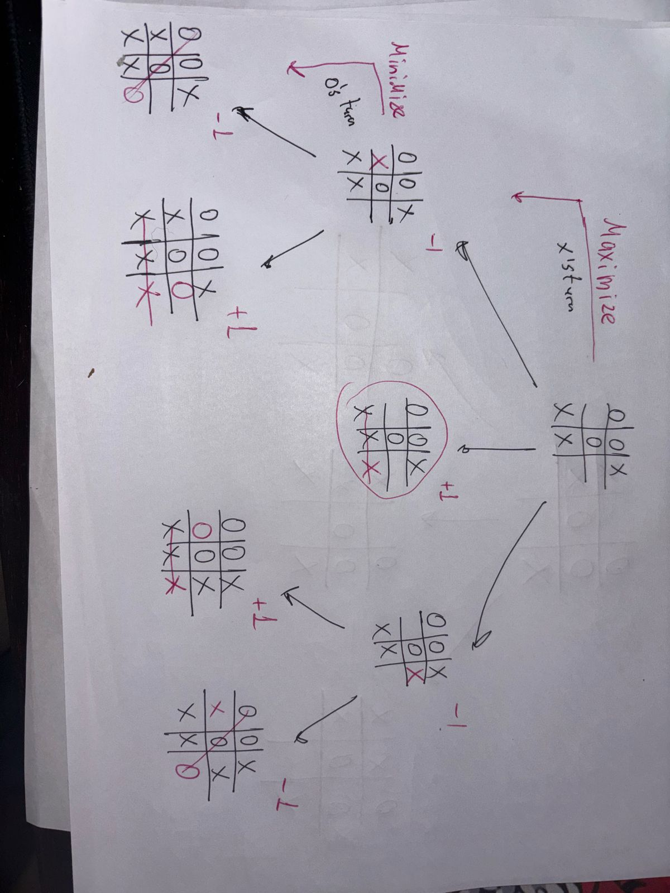

# Tic Tac Toe Game

Simple implementation of the Tic Tac Toe game Using the **Minimax Algorithm**

### How It Works:

1. **Minimization and Maximization**:
    - The Program (usually the "Maximizing" player) tries to maximize its score, while the opponent (usually the "Minimizing" player) tries to minimize the Program’s score.

2. **Recursion**:
    - The algorithm recursively evaluates all possible moves by simulating each turn until the game reaches a terminal state (win, lose, or draw).

3. **Evaluation Function**:
    - The algorithm assigns scores to the terminal states: `+1` for a win, `-1` for a loss, and `0` for a draw.

4. **Backtracking**:
    - Once all possible moves are evaluated, the algorithm backtracks through the recursion tree to determine the best move for the Program.

By using this algorithm, the Program ensures that it plays optimally, minimizing its chances of losing and always aiming for the best possible outcome.

